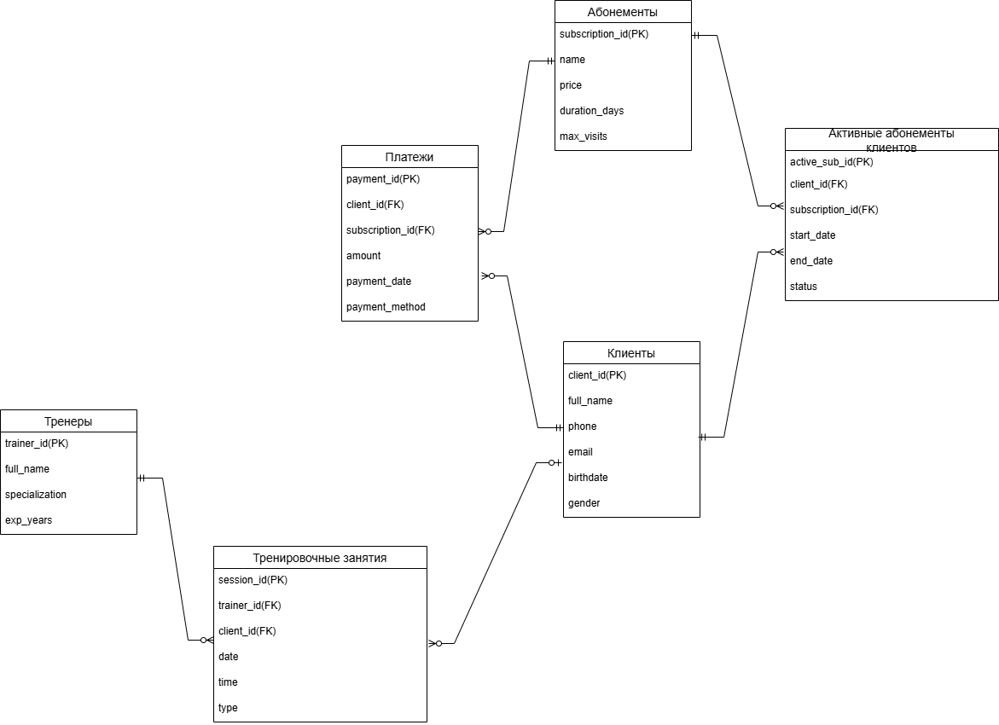

# База данных для фитнес-клуба  

## Назначение базы данных

База данных разработана для управления деятельностью фитнес-клуба. В ней хранятся данные о клиентах, тренерах, абонементах, тренировках, оплатах и действующих подписках. Также реализован механизм хранения истории изменений по подпискам.

---

## Таблицы в базе данных

**Clients** — информация о клиентах (ФИО, пол, дата рождения, контакты)  
**Trainers** — информация о тренерах (ФИО, специализация, опыт)  
**Memberships** — виды абонементов (название, цена, длительность, лимит посещений)  
**ClientMemberships** — абонементы клиентов с датами и статусом  
**TrainingSessions** — записи о тренировках: кто, с кем, когда, тип  
**Payments** — информация об оплатах (сумма, дата, способ, статус)

---

## Версионная таблица

**ClientMemberships** — реализует хранение истории изменений подписок клиента:  
- Каждая запись содержит дату начала (`start_date`) и окончания (`end_date`) действия абонемента, а также текущий `status`.
- Таким образом, таблица фиксирует все версии подписки.

---

## Нормальная форма

База данных приведена к **третьей нормальной форме (3NF)**.

**Обоснование:**
- **1NF:** Все поля атомарны, повторяющихся групп нет.
- **2NF:** Нет частичных зависимостей.
- **3NF:** Нет транзитивных зависимостей. Например, поля `price` и `duration_days` зависят только от `subscription_id` в `Memberships`.

**Почему именно 3NF:**  
Она позволяет избежать дублирования данных, упрощает обновления и повышает целостность. Это важно для систем, где отслеживаются финансовые транзакции, история клиентов и активности по подпискам.

---

## Файлы проекта

- [Fitness.sql](https://github.com/prudick42/data_base/blob/main/Fitness.sql) — создание таблиц  
- [Information_for_tables.sql](https://github.com/prudick42/data_base/blob/main/information_for_tables.sql) — вставка данных  
- [Script.sql](https://github.com/prudick42/data_base/blob/main/Script.sql) — SQL-запросы

---

## Диаграммы

### Концептуальная модель  

### Логическая модель  

### Физическая модель  
  

**Выполнил:** Руди Кирилл